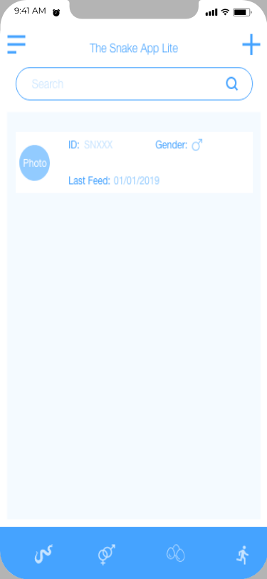
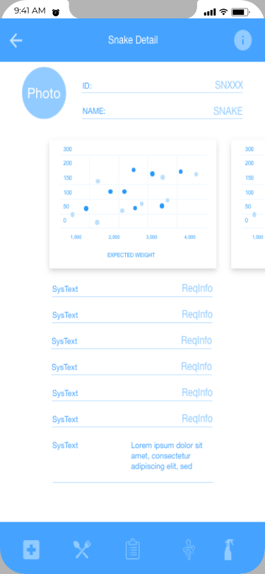

# The Snake App Lite
## Description
TSALite is an app that will help Snake's keepers to know about TSA App, with knowing a little from the full app free.
Available Functions will we: 
Adding Only 1 snake.
Requesting Snake Species.
Shortcuts for Knowing about the team, buying full app.
Snake's Detail information (Weight, last feed, clean, etc.)

## Wireframe - Low Fidellity
Wireframes are used to see UX, basically the way user will interact with the app by knowing where will the buttons, text's, etc. will be.

### Lobby - Snake Lists

### Snake Detail

## Mockup - High Fidellity
A high fidellity design will mostly be recognized as a Mock up, this is the way the app will look, colors, fonts used, etc.

## Made with
* [AdobeXd](https://www.adobe.com/mx/products/xd.html) - Adobe Xd

## Author 
 **Jay Ramirez**  [MoreRepos](https://github.com/JayRmz)
